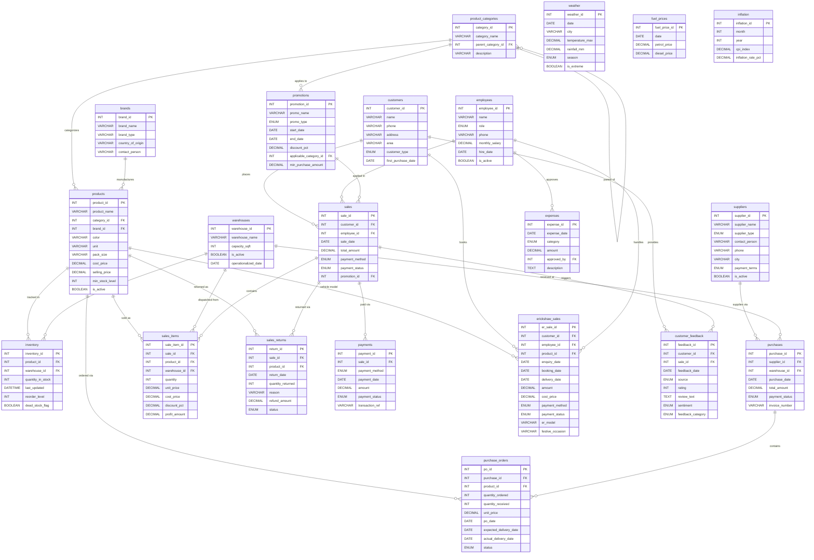

# Entity Relationship Diagram (ERD)
## Swastik Traders — Retail Analytics Ecosystem

**Version:** 2.0 (Updated — logistics table removed, schema corrected)
**Date:** July 2026
**Database:** MySQL
**Total Tables:** 21 (18 core + 3 external reference)

> **Change from v1.0:** `logistics` table dropped (not a business concern). `sale_channel` removed from `sales`. Payment methods updated to cash/UPI/bank_transfer only. Employee roles updated. Expense categories updated. `erickshaw_sales` simplified.

---

## ERD — Mermaid Diagram

---

## Table Summary

| # | Table | Type | Est. Rows | Notes |
|---|---|---|---|---|
| 1 | `customers` | Dimension | 500–900 | Local buyers in Ballia area |
| 2 | `products` | Dimension | 80–120 | All brand × product × size SKUs |
| 3 | `product_categories` | Dimension | 8–12 | Interior/Exterior/Putty/Primer/Enamel/Accessory/E-Rickshaw |
| 4 | `brands` | Dimension | 5–6 | Asian Paints, Indigo, JSW, Saarthi, City Life |
| 5 | `suppliers` | Dimension | 15–30 | Brand distributors + accessory wholesalers |
| 6 | `warehouses` | Dimension | 2 | Godown 1 + Godown 2 |
| 7 | `employees` | Dimension | 7 | 1 owner, 2 co-founders, 4 labourers |
| 8 | `promotions` | Dimension | 20–40 | Festival campaigns |
| 9 | `inventory` | Fact (snapshot) | 160–240 | Products × 2 godowns |
| 10 | `purchases` | Fact | 400–700 | Procurement events |
| 11 | `purchase_orders` | Fact | 1,200–2,000 | Line items per procurement |
| 12 | `sales` | Fact | 4,000–7,000 | In-store transactions |
| 13 | `sales_items` | Fact | 10,000–20,000 | Line items per sale |
| 14 | `sales_returns` | Fact | 50–120 | Very rare — paint/e-rickshaw rarely returned |
| 15 | `payments` | Fact | 4,000–7,000 | Cash / UPI / bank transfer |
| 16 | `expenses` | Fact | 400–700 | Monthly salary, utilities, maintenance, marketing |
| 17 | `erickshaw_sales` | Fact | 80–120 | ~1/week or fortnight; festival spikes |
| 18 | `customer_feedback` | Fact | 800–1,500 | In-store + WhatsApp + Google Maps |
| 19 | `weather` | External Ref | ~1,200 | Daily; Ballia, UP |
| 20 | `fuel_prices` | External Ref | ~1,200 | Daily; UP region |
| 21 | `inflation` | External Ref | ~42 | Monthly; general CPI |

**Total estimated rows (core tables):** ~22,000–40,000

---

## Key Design Decisions (v2.0)

1. **`logistics` table dropped:** Delivery is not a tracked business process. Suppliers deliver to godowns directly; customers carry or labourers assist with loading. No dispatch/delivery lifecycle to model.

2. **`sale_channel` removed from `sales`:** All sales are in-store. No field needed.

3. **Payment methods:** `ENUM('cash', 'upi', 'bank_transfer')` only. No cheque, no credit/EMI.

4. **Employee roles:** `ENUM('owner', 'co_founder', 'labour')` — 7 people total. Owner and co-founders handle billing/customer interaction; labourers handle loading, godown management.

5. **Expense categories:** `ENUM('salary', 'utilities', 'maintenance', 'marketing', 'one_time_setup')` — No rent. One-time setup cost (~₹10L) recorded as `one_time_setup` in early 2022 records.

6. **`erickshaw_sales` has `festive_occasion` column:** To capture whether the sale coincided with Akshaya Tritiya, Diwali, Navratri, etc. — enables direct festive correlation analysis without relying solely on date joins.

7. **`sales_returns.quantity` expected to be very low:** Generator should produce returns at ~1–2% of sales volume, primarily for paint (wrong colour ordered) rather than e-rickshaws.

8. **`customers.customer_type`:** `ENUM('retail', 'contractor', 'painter')` — no dealer/B2B selling. All are end-consumers buying for their own use or project.

9. **`products.pack_size`:** Stores the physical size (e.g., "20L", "40kg", "4 inch") as a string alongside the `unit`. This enables SKU-level margin analysis by pack size.

10. **Star schema in Power BI:** `sales_items` acts as the main fact table. `product_categories`, `brands`, `products`, `customers`, and a Date dimension form the star schema. `erickshaw_sales` is a secondary fact table with its own dimension joins.
