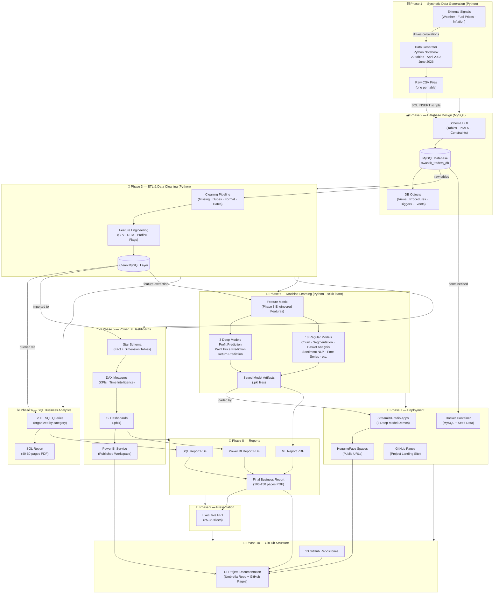

# Project Architecture Diagram
## Swastik Traders — Retail Analytics Ecosystem

**Version:** 1.0
**Date:** July 2026

---

## Full Data Pipeline



---

## Technology Stack

| Layer | Technology | Purpose |
|---|---|---|
| **Data Generation** | Python (Faker, NumPy, Pandas) | Synthetic data generation with realistic correlations |
| **Database** | MySQL 8.x | Core transactional + analytical database |
| **ETL/Cleaning** | Python (Pandas, re, datetime) | Data cleaning + feature engineering pipeline |
| **SQL Analytics** | MySQL (advanced SQL) | 200+ business analytics queries |
| **BI/Dashboards** | Power BI Desktop + Power BI Service | 12 interactive dashboards |
| **Machine Learning** | Python (scikit-learn, XGBoost, LightGBM, NLTK/spaCy) | 13 ML models (3 deep + 10 regular) |
| **ML Deployment** | Streamlit or Gradio | Interactive model demo apps |
| **App Hosting** | HuggingFace Spaces / Render | Free public hosting for ML demos |
| **DB Containerization** | Docker + docker-compose | Reproducible MySQL setup |
| **Documentation Site** | GitHub Pages | Project front door |
| **Version Control** | Git + GitHub | 13 repositories under one org |
| **Reporting** | MS Word / Google Docs → PDF | SQL, BI, ML, Final Business Reports |
| **Presentation** | PowerPoint / Google Slides | Executive deck |

---

## Data Flow Summary

```
External Signals (Weather/Fuel/Inflation)
        ↓ (drives correlations)
[Python Generator] → CSV Files (22 tables)
        ↓ (SQL INSERT scripts)
[MySQL Database] → Schema + Views + Triggers + Procedures
        ↓ (Python ETL)
[Cleaned Data Layer] → Engineered Features (CLV, RFM, Profit%, etc.)
        ↓                        ↓                        ↓
[SQL Analytics]          [Power BI Dashboards]     [ML Models]
200+ queries              12 dashboards              13 models
SQL Report                BI Report                  ML Report
        ↓                        ↓                        ↓
                    [Final Business Report]
                    [Executive Presentation]
                            ↓
                [GitHub Pages — Project Landing]
```

---

## Key Architectural Decisions

1. **Two-layer MySQL architecture:** Raw imported data stays in base tables. Views + the cleaned Python output form the analytics layer. Keeps raw data recoverable without overwriting.

2. **Feature engineering in Python, not SQL:** CLV, RFM segments, flags are computed in the Phase 3 Python notebook and written back to the database as enriched columns/tables — easier to document and version-control than SQL-only transformations.

3. **Star schema in Power BI separate from MySQL 3NF:** MySQL is normalized for transactional integrity; Power BI imports denormalized views for performance. The star schema is built inside Power BI's data model layer.

4. **ML model outputs feed back into Power BI:** Sentiment labels from the NLP model and time series forecasts are exported as CSVs and imported into Power BI for the Review Dashboard and Forecast Dashboard — creating a real ML→BI feedback loop.

5. **Docker for reproducibility:** The MySQL database is containerized so evaluators can spin up the exact same environment with one command, without needing a local MySQL install.
